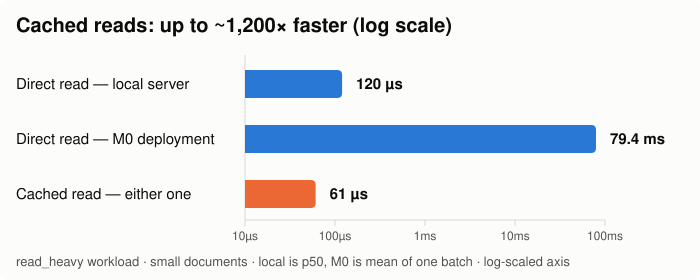

# client-query-cache

Client-side caching for PyMongo, kept coherent using MongoDB change streams. For Python applications that already talk to MongoDB through PyMongo directly, it adds a coherent read cache without introducing a separate cache server or changing how you connect. The library supports synchronous and asyncio clients.

It caches reads whose results the manager can invalidate correctly when the underlying data changes, and leaves everything else — including all writes — to go straight to MongoDB through `.raw`. Invalidation is asynchronous: a read running concurrently with a write can still return the previous cached value until the manager processes that write's change-stream event.



Median latency from one of the [retained benchmark reports](docs/stream-cost-benchmarks.md) — a local, single-node measurement for one workload, not a universal performance guarantee. See [Stream cost benchmarks](docs/stream-cost-benchmarks.md) for the full workload matrix and how to reproduce it.

---

## Requirements

`client-query-cache` requires Python 3.14.6 or newer.

Reads and writes work against any MongoDB deployment PyMongo supports. **Effective caching** needs two separate things: a replica set or sharded cluster, since MongoDB only provides change streams on one of those topologies, not a standalone server; and MongoDB 8.0 or newer, a floor this library enforces itself at startup rather than a limit of change streams themselves. Against a deployment that doesn't meet both, the manager doesn't raise: it logs a warning and bypasses the cache for that database, executing every read as a normal, uncached PyMongo call.

## Install

```bash
uv add client-query-cache
```

Or with pip: `pip install client-query-cache`.

## Usage

`CacheManager` wraps a `pymongo.MongoClient` (or `pymongo.AsyncMongoClient`) that you construct and own. Its database and collection facades cache a narrow set of PyMongo's own read methods — `find_one`, `find`, `aggregate`, `count_documents`, `estimated_document_count`, and `distinct` — and keep cached results coherent as the underlying data changes. Every other operation, including all writes, remains available through the wrapped PyMongo object via `.raw`:

```python
from pymongo import MongoClient

from client_query_cache import CacheManager

with (
    MongoClient("mongodb://localhost:27017") as client,
    CacheManager(client) as manager,
):
    collection = manager["my_database"]["my_collection"]
    collection.raw.insert_one({"_id": "example", "value": 42})

    collection.find_one({"_id": "example"})  # cache miss: reads from MongoDB
    collection.find_one({"_id": "example"})  # cache hit: served from the cache
    print(manager.cache_core.snapshot().hits)  # 1
    # bridge stats like this into OpenTelemetry: docs/architecture.md#opentelemetry-metrics

    collection.raw.create_index("email", unique=True)
    collection.raw.insert_one({"_id": "user-1", "email": "a@example.com"})
    collection.find_one({"email": "a@example.com"})  # also cached, like an `_id` lookup
```

`find_one` caches a lookup by `_id` and by any other field the database enforces as unique, discovered automatically from the collection's own indexes — there's nothing to declare. Only a plain unique index qualifies: a partial, sparse, or hashed unique index, or a read whose collation doesn't match the index's collation, falls back to an uncached read instead.

`CacheManager` starts a background change-stream task the first time a read touches a database, so close it (or use it as a context manager, as above) alongside the client — closing only the client leaves that background task running against a closed connection.

The same facades are available for `pymongo.AsyncMongoClient` under `client_query_cache.asynchronous`, with the same methods as coroutines:

```python
import asyncio

from pymongo import AsyncMongoClient

from client_query_cache.asynchronous import CacheManager


async def main() -> None:
    async with (
        AsyncMongoClient("mongodb://localhost:27017") as client,
        CacheManager(client) as manager,
    ):
        collection = manager["my_database"]["my_collection"]
        await collection.raw.insert_one({"_id": "example", "value": 42})

        await collection.find_one({"_id": "example"})  # cache miss
        await collection.find_one({"_id": "example"})  # cache hit


asyncio.run(main())
```

A read bypasses the cache instead of using it whenever caching it safely isn't possible — for example, a caller-selected session, read preference, or read concern; a view; a nondeterministic or cross-collection aggregation pipeline; a time-series collection; or a database whose change stream isn't healthy. See [Bypass conditions](docs/api-reference.md#bypass-conditions) in the API reference for the complete list.

## Scope and constraints

- **Writes aren't cached** — only the six read methods listed above are. See [why only reads are cached](docs/architecture.md#why-only-reads-are-cached) for the rationale.
- **Each `CacheManager` is independent** — it owns its own in-process cache and its own change-stream cursors; nothing is shared between managers or processes. See [capacity planning](docs/architecture.md#capacity-estimation) before creating one per request or one per worker process.

## Documentation

- [API reference](docs/api-reference.md) — the complete public surface: construction, configuration, limits, ownership, and raw fallback.
- [Architecture and operations](docs/architecture.md) — system requirements, capacity planning, retry/error handling, observability, security, and recovery behavior.
- [Stream cost benchmarks](docs/stream-cost-benchmarks.md) — whether caching fits your workload, and the controlled benchmark reports backing that guidance.
